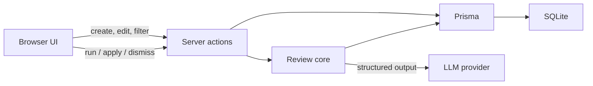

# Code Snippet Reviewer

Lightweight, self-service code review for ad-hoc snippets (Gitar take-home).

## Setup Instructions

### Quick start (Docker)

```bash
cp .env.example .env
# Required: set OPENAI_API_KEY in .env (default REVIEW_MODEL is OpenAI)
docker compose up --build
```

Open [http://localhost:3000](http://localhost:3000). Without an API key the app
still starts, but **Run review** fails. On first start (empty database), Compose
seeds sample snippets so you can browse the UI immediately.

### Local development

Use **Node 24** (same major as the Docker image; see `.nvmrc`). One
`package-lock.json` is shared by local and Docker — do not maintain separate
lockfiles. Keep `node_modules` on the host only; Compose never mounts it
(native addons differ between macOS and Linux).

```bash
cp .env.example .env
# Required: set OPENAI_API_KEY in .env
nvm use   # or: fnm use / asdf install — must be Node 24
npm ci
npm run db:generate
npm run db:deploy
# Optional: npm run db:seed  # load sample snippets
npm run dev
```

Create a migration after changing `prisma/schema.prisma`:

```bash
npm run db:migrate -- --name describe_your_change
```


## Architecture Overview

Next.js App Router hosts both the UI and the server. Mutations go through
server actions. Reviews call an LLM via the Vercel AI SDK, then persist
structured findings in SQLite through Prisma.




**Why these choices**

- **Next.js + server actions** — shared TypeScript types from form validation
  through persistence; UI and server stay colocated so review state transitions
  stay easy to follow end-to-end.
- **SQLite + Prisma** — persistent store with migrations and a clear schema
  (`Snippet` → `Review` → `Finding`), without a separate database service.
- **Vercel AI SDK + Zod** — provider-agnostic model calls with validated
  structured findings; swapping models later is a `REVIEW_MODEL` change
  (OpenAI or Anthropic) without rewriting the review pipeline.
- **Review held in the request** — the run waits on the LLM inside one server
  action (not a job queue). Keeps the control flow linear; tradeoffs are covered
  below in the review lifecycle.


### Project layout

- `src/app` — routes and server actions
- `src/components` — dashboard, snippet detail, findings UI
- `src/lib/review/` — analyze, run, apply, patch validation
- `src/lib/db.ts` / `create-prisma-client.ts` — Prisma access
- `prisma/` — schema and migrations
- `evals/` / `scripts/` — optional fixtures, CLI, and live evals


## Review experience and user stories

The snippet detail page is the center of the review workflow. It keeps the code,
review status, selected finding, and pending actions synchronized while server
actions remain the authority for persisted state.

### Review a snippet

**As a developer, I can run an AI review on the current snippet so that I get
line-level feedback.**

1. The user opens `/snippets/:id` and clicks **Run review**.
2. The page clears the previous findings immediately, shows
  `Review in progress`, and disables editing and duplicate review requests.
3. The `runSnippetReview` server action calls `runReview` and waits for the LLM
  result. This is one server-action request; it is not a background job and the
   page does not poll.
4. The result is persisted as `COMPLETED`, `FAILED`, or discarded as
  `SUPERSEDED`.
5. The page refreshes its server data and displays either the new findings, an
  empty successful state, or an error that allows the user to retry.

Re-running a review intentionally replaces the previous one. Existing findings
are deleted when the new run starts so feedback from two analyses is never
mixed.

### Inspect findings

**As a developer, I can inspect each finding in context so that I understand the
issue before acting on it.**

- Findings show their line range, severity, category, description, resolution,
and optional suggested change.
- Selecting a finding highlights and scrolls to its source range in the editor.
- The findings list supports arrow keys plus Home and End.
- The suggested-change view is self-contained: its removed lines come from the
code captured during the review, not from whatever happens to be in the
editor later.


### Apply several suggestions

**As a developer, I can apply compatible suggestions one after another without
having to run a new review after every change.**

When the user clicks **Apply suggestion**, the server:

1. Verifies that the finding is still `OPEN`, has a valid patch, belongs to a
  completed review, and was produced from the current content version.
2. Looks for the patch's exact `before` lines at the finding's expected range.
  If they moved, it relocates them only when there is exactly one match in the
   snippet. Missing or ambiguous matches are rejected.
3. Builds the next code from the patch's `after` lines.
4. Commits the code, incremented content version, accepted finding, and all
  affected finding positions in one database transaction.
5. Returns the canonical code, version, and finding states to the browser. The
  UI updates immediately and then refreshes server-rendered data.

Findings strictly after the applied range are shifted by the line-count delta.
This is what lets a second, non-overlapping suggestion remain applicable after
the first one inserts or removes lines.

Findings that overlap the changed range become `STALE` and display
**Needs re-review**. They are not applied automatically because their assumptions
may no longer be valid.

### Dismiss a finding

**As a developer, I can dismiss feedback that I do not want to apply.**

Dismissal changes an `OPEN` finding to `DISMISSED` with a compare-and-swap
update. If another request resolved it first, the action fails instead of
overwriting the newer state.

### Edit the snippet

**As a developer, I can edit the title, language, or code while keeping review
results trustworthy.**

- A title-only edit keeps the current review because it does not change the
analyzed source.
- A code or language edit increments `contentVersion` and deletes the review
and its findings because their line references are no longer trustworthy.
- Saving sends the version currently displayed by the browser. If another
request changed the snippet first, the save is rejected and the user is asked
to refresh.
- Editing, running a review, and applying/dismissing findings are mutually
disabled where needed so a late response cannot silently overwrite an active
draft.


## Review lifecycle


### 1. Structured model output

`src/lib/review/analyze.ts` calls the configured model through the Vercel AI SDK
with a Zod structured-output schema. The model receives the language and code,
but not the title, to avoid bias from user-provided labels.

Each model finding contains:

- a 1-based `startLine` and optional inclusive `endLine`;
- `severity`: `CRITICAL`, `WARNING`, or `INFO`;
- `category`: `BUG`, `SECURITY`, `PERFORMANCE`, `STYLE`, or `OTHER`;
- a plain-language description;
- `replacementLines`, or `null` when no safe automatic change is available.

The analyzer drops findings whose start line is outside the snippet, clamps
invalid end lines, trims descriptions, and aligns replacement indentation.

### 2. Lossless suggestion patches

The model only proposes replacement lines. The application captures the exact
source range itself and stores a versioned JSON patch:

```json
{
  "version": 1,
  "before": ["  return a - b;"],
  "after": ["  return a + b;"]
}
```

Arrays make deletion (`after: []`) different from one blank replacement line
(`after: [""]`) and preserve source lines beginning with `+` or `-`. The patch
therefore has no ambiguous textual diff syntax.

### 3. Starting and completing a review

`src/lib/review/run-review.ts` owns the database lifecycle:

```text
Snippet detail UI
    │ runSnippetReview(snippetId)
    ▼
Review = IN_PROGRESS + sourceVersion + unique runToken
    │
    ▼
analyzeSnippet(language, code) ──► AI SDK ──► REVIEW_MODEL
    │
    ├── matching token and content version ──► COMPLETED + findings
    ├── model/provider error ────────────────► FAILED + error message
    └── newer run or edited source ─────────► SUPERSEDED, result discarded
```

The review captures the snippet's `contentVersion` as `sourceVersion`. Before
writing either success or failure, it verifies:

- its unique `runToken` still owns the review;
- the review still targets the captured source version;
- the snippet still has that content version.

Consequently, an older concurrent run cannot replace a newer run, and an LLM
response for code edited while the model was working cannot create stale
findings.

### 4. Applying a suggestion safely

`src/lib/review/apply-suggestion.ts` performs an optimistic, transactional write:

- `Snippet.contentVersion` is the compare-and-swap value for source changes.
- `Review.sourceVersion` identifies the code represented by its findings.
- The selected finding must still be `OPEN`.
- The patch's frozen `before` block must still match exactly.
- Code replacement, version increments, finding resolution, stale marking, and
line shifts either all commit or all roll back.

After a successful apply, both versions advance together. This preserves the
remaining compatible findings without pretending that overlapping findings are
still safe.

### Status semantics

Review statuses:

- `IN_PROGRESS` — the current run has started and prior findings were cleared.
- `COMPLETED` — the findings, including an empty list, were persisted.
- `FAILED` — the current run failed and its error is available to the UI.
- `SUPERSEDED` — an in-memory result used when this run lost a token or version
race; it is not persisted over the winning review.

Finding resolutions:

- `OPEN` — available to inspect, dismiss, and optionally apply.
- `ACCEPTED` — its suggestion was applied successfully.
- `DISMISSED` — the user chose not to act on it.
- `STALE` — another applied change overlapped its source range; a new review is
required.


### Main implementation boundaries

1. `src/components/SnippetDetailContent.tsx` coordinates editor, status, local
  canonical state, and page refreshes.
2. `src/components/FindingsPanel.tsx` owns finding action transitions, errors,
  selection, and keyboard navigation.
3. `src/app/actions/reviews.ts` exposes review, apply, and dismiss server actions.
4. `src/lib/review/analyze.ts` handles model output and sanitization without
  database access.
5. `src/lib/review/run-review.ts` orchestrates review persistence and concurrent
  runs.
6. `src/lib/review/apply-suggestion.ts` validates and transactionally applies
  patches.
7. `src/lib/review/suggestion-patch.ts` validates the stored patch format.
8. `src/app/actions/snippets.ts` invalidates reviews when code or language
  changes.


## What I'd do differently

*To be filled in before submission.*

## AI usage log

*To be filled in before submission.*

## Appendix: CLI, seeding, and debugging

Optional tools for local development. Not required to exercise the app through
the UI.

Local `npm run dev` and Docker Compose use separate SQLite files (project
`data/dev.db` vs the Compose `snippet-data` volume). They are not synced. Compose
also runs a one-shot `db-init` to `chown` the volume for the non-root app user
so SQLite is writable inside the container.

### Review CLI

```bash
# Review a snippet already in the local database
npm run review -- <snippetId>

# Live LLM fixture evals (costs tokens)
npm run eval:review

# Replace local snippets with deterministic UI fixtures
npm run db:seed
```

Default model: `REVIEW_MODEL=openai:gpt-5.6-luna` (override in `.env`).
Switch providers with the same format, e.g. `anthropic:claude-sonnet-4-5`.

`db:seed` deletes the snippets in the local database before recreating the
fixtures. Pass `--if-empty` to seed only when the database has no snippets
(Compose uses this so Docker restarts keep user data). `mixed-security-bug` and
`triple-issues` include completed reviews so their findings and apply actions
can be exercised without calling an LLM.

### Debugging reviews

Optional `.env` flags (independent):

- `INCLUDE_DEBUG_BODY=1` — log raw provider request/response bodies to the console
- `AI_SDK_DEVTOOLS=1` — capture runs for [DevTools](https://ai-sdk.dev/docs/ai-sdk-core/devtools) (local only)

With DevTools enabled, run a review or eval in one terminal and the viewer in another:

```bash
npm run devtools
```

Open [http://localhost:4983](http://localhost:4983) to inspect prompts, outputs, and token usage.
Captures are stored in `.devtools/` (gitignored).