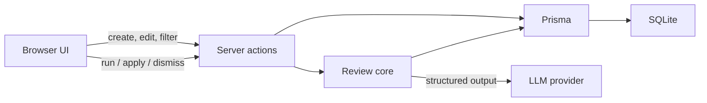
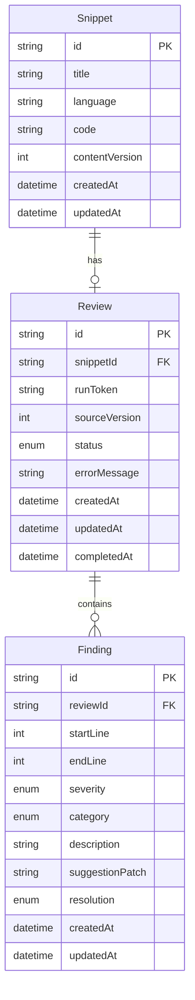

# Code Snippet Reviewer

A small web app for reviewing short, ad-hoc code snippets with an LLM — not full
PRs or repositories. Paste a snippet, run a review, inspect line-level findings,
then apply or dismiss each suggestion.

## Setup Instructions

### Quick start (Docker)

```bash
cp .env.example .env
# Required: set OPENAI_API_KEY in .env (default REVIEW_MODEL is OpenAI)
docker compose up --build
```

Open [http://localhost:3000](http://localhost:3000). Without an API key the app
still starts, but **Run review** fails. On first start (empty database), Compose
seeds sample snippets so you can browse the UI immediately.

### Local development

Use **Node 24** (same major as the Docker image; see `.nvmrc`). One
`package-lock.json` is shared by local and Docker — do not maintain separate
lockfiles. Keep `node_modules` on the host only; Compose never mounts it
(native addons differ between macOS and Linux).

```bash
cp .env.example .env
# Required: set OPENAI_API_KEY in .env
nvm use   # or: fnm use / asdf install — must be Node 24
npm ci
npm run db:generate
npm run db:deploy
# Optional: npm run db:seed  # load sample snippets
npm run dev
```

Create a migration after changing `prisma/schema.prisma`:

```bash
npm run db:migrate -- --name describe_your_change
```


## Architecture Overview

Next.js App Router hosts both the UI and the server. Mutations go through
server actions. Reviews call an LLM via the Vercel AI SDK, then persist
structured findings in SQLite through Prisma.




**Why these choices**

- **Next.js + server actions** — shared TypeScript types from form validation
  through persistence; UI and server stay colocated so review state transitions
  stay easy to follow end-to-end.
- **SQLite + Prisma** — persistent store with migrations and a clear schema
  (`Snippet` → `Review` → `Finding`), without a separate database service.
- **Vercel AI SDK + Zod** — provider-agnostic model calls with validated
  structured findings; swapping models later is a `REVIEW_MODEL` change
  (OpenAI or Anthropic) without rewriting the review pipeline.
- **Review held in the request** — the run waits on the LLM inside one server
  action rather than a background job queue (see Review process).

### User flows

**Dashboard**

- Lists snippets with title, language, created date, and review status.
- Filter by language and review status; sort columns.
- Click a row to open the snippet page.
- Create a snippet (title, language, code body). The modal defaults to
  **Create and Review** (saves then starts an AI review); **Create** saves only.

**Snippet page**

- Edit title, language, and code. Changing language or code discards the current
  review and its findings; a title-only edit keeps them.
- Run a review to get findings: each finding is a line-scoped issue with
  severity, category, description, and optional suggested change.
- Select a finding to highlight and scroll to its lines in the editor.
- Apply a suggestion to patch the code, or dismiss a finding. Non-overlapping
  suggestions can be applied one after another; overlapping ones become stale
  and need a re-review.
- If a review fails, the error is shown and the user can retry.

### Project layout

- `src/app` — routes and server actions
- `src/components` — dashboard, snippet detail, findings UI
- `src/lib/review/` — analyze, run, apply, patch validation
- `src/lib/db.ts` / `create-prisma-client.ts` — Prisma access
- `prisma/` — schema and migrations
- `evals/` / `scripts/` — optional fixtures, CLI, and live evals

### Review process

#### Producing structured findings

1. Send the snippet’s **language** and **line-numbered code** (not the title,
   to avoid bias from the user’s label).
2. Ask for findings: line range, severity, category, description, and optional
   **replacement lines** for that range — new lines, an empty list to delete the
   range, or none if there is no safe automatic fix.
3. Sanitize the response (invalid lines, ranges, whitespace).
4. For each finding with replacement lines, build a patch: **before** = those
   lines as they are in the snippet today, **after** = the model’s replacement.
5. Persist the findings (and patches) with the review.

The model only proposes the new lines; the app records the current source itself.
That keeps applies exact and avoids fragile textual diffs.

#### Running a review

The UI starts a review, the server marks it in progress, calls the LLM, then
persists findings or an error — all inside one server-action request. The page
shows progress for that wait; there is no background worker or polling.

**Trade-off:** this keeps the flow easy to reason about (one request, one
outcome). The cost is a long-held HTTP request: slow models or proxies may time
out, and closing or reloading the page mid-run can leave the review looking
in-progress until the user retries. A job queue with polling or streaming would
handle that better in production.

On success we save findings as completed; on provider/model failure we save an
error the user can retry. If the snippet was edited or a newer review started
meanwhile, that run’s result is discarded so stale findings never land.

#### Applying or dismissing

- **Dismiss** marks a finding resolved without changing the code.
- **Apply** checks the stored `before` still matches, replaces it with `after`,
  and updates finding positions in one transaction. Later non-overlapping
  findings stay usable; overlapping ones become stale and need a re-review.

#### Statuses (short)

Reviews: not reviewed → in progress → completed or failed.

Findings: open → accepted, dismissed, or stale.


## What I'd do differently

**Highest priority**

- **Observability** — structured logs, traces, and per-review token/latency/cost
  metrics so failures and spend are visible in production.

**Product / review quality**

- **Iterate on how findings are generated** — today’s path is a single
  structured call; I’d try richer pipelines (e.g. multi-pass, verify-before-
  keep, or static analysis + LLM) and keep iterating on prompts and schema.
- **Stronger evals first** — I don’t have enough coverage to know whether
  findings are consistently good (right severity, category, and substance).
  Before leaning harder on the LLM in production, I’d expand fixture evals so
  quality is measurable, not just anecdotal.
- **Feedback loop** — use accept/dismiss (and maybe short reasons) to improve
  prompts, ranking, or evals over time instead of treating every review as
  one-shot.
- **Delete snippet** — small UX gap; users should be able to remove snippets
  from the dashboard.
- **Smarter create UX** — let the user paste only the code body; detect the
  language automatically and have an LLM suggest a title, instead of requiring
  title + language up front.

**If this were a larger production system**

- **Background review jobs** — move the LLM call off the request (queue +
  polling or streaming) so reviews survive reloads and don’t hit HTTP timeouts
  (see the trade-off under Review process).
- **Separate API** — extract a real HTTP/API layer instead of only Next.js
  server actions, so other clients and workers can share the same backend.
- **Different database / schema shape** — e.g. Postgres for multi-instance
  writes and clearer multi-user ownership, rather than a single SQLite file.

## AI usage log

### Tools and models

1. **Coding agent (Cursor)** — main environment. Mostly **Grok 4.5** (high);
   sometimes **GPT-5.6 Sol** (medium or high) for complex tasks and double checking. **Plan mode** was usually used before large changes.
2. **Voice dictation** — speak freely and dump long prompts with full context
   instead of typing short, incomplete instructions.
3. **PR review bots** — Cursor Bugbot and Cubic to catch issues before merging a PR. I would
   have used Gitar too, but my free trial had ended.

### Examples

1. **Planning from the brief** — Before writing code, I shared the assignment
   PDF and discussed approach, trade-offs, likely pitfalls, and how to break
   the project into slices.
2. **Scaffolding and Docker** — Cursor helped set up Next.js and Docker Compose
   (I was less familiar with Compose). That mostly worked, but I hit Node /
   `package-lock.json` mismatches between my Mac and the Linux image. The model
   struggled to find the real issue; I diagnosed it and steered the fix (e.g.
   prefer `npm i` over a brittle `npm ci` path for this setup). With more time
   for production, I’d tighten install/lockfile handling further.
3. **Database changes** — For schema and data-layer work, I asked the agent
   directly whenever I needed to add or change something; it updated Prisma /
   migrations and kept that slice moving without me hand-writing each step.
4. **Triage PR review comments** — On bigger PRs the bots flagged many edge
   cases. I read each one, asked the agent to explain anything unclear, then
   applied what mattered and skipped noisy or low-value suggestions.
5. **UI with browser tools** — For the interface, Cursor’s browser access was
   especially useful: it can exercise the UI itself, take screenshots, and I
   can point at a specific element in the page when I want a change.

### Overall impression

- Great sparring partner for design and trade-offs.
- Speeds up planning, scaffolding, database iteration, and UI work.
- Less reliable on environment / lockfile conflicts — I had to own the diagnosis.
- Review bots were extremely useful — they catch edge cases the model often
  misses while planning or implementing (still filter signal from noise).

## Appendix

### Database schema

SQLite via Prisma. One snippet has at most one review; a review has many
findings.



Enums:

- `Review.status` — `IN_PROGRESS`, `COMPLETED`, `FAILED`
- `Finding.severity` — `CRITICAL`, `WARNING`, `INFO`
- `Finding.category` — `BUG`, `SECURITY`, `PERFORMANCE`, `STYLE`, `OTHER`
- `Finding.resolution` — `OPEN`, `ACCEPTED`, `DISMISSED`, `STALE`

**`Snippet.contentVersion`** — integer that bumps whenever the snippet’s code
(or language) changes, and again when a suggestion is applied. Saves and applies
send the version the browser thinks is current; if it doesn’t match the DB, the
write is rejected (someone else already changed the code).

**`Review.sourceVersion`** — which `contentVersion` this review’s findings
currently describe. Set when the review starts (the code the LLM analyzed).
Before an apply is allowed, it must still equal the snippet’s
`contentVersion`; after a successful apply, both bump together so remaining
non-overlapping findings stay usable. If the user edits the code manually (or
the LLM finishes against an outdated snapshot), the versions diverge and
suggestions are treated as stale until a new review.

**`runToken`** — opaque id for the active review run. Only the run that still
owns the token may write `COMPLETED` / `FAILED`, so a slower older request can’t
overwrite a newer one.

`suggestionPatch` is a JSON string (or `null` when there is no safe automatic
fix). Example:

```json
{
  "version": 1,
  "before": ["  return a - b;"],
  "after": ["  return a + b;"]
}
```

`before` is the exact source lines at review time; `after` is the model’s
replacement (`[]` deletes the range, `[""]` leaves one blank line). Apply
checks that `before` still matches before writing `after`.

`version` is the **patch format** version (currently always `1`), not the
snippet’s `contentVersion`. It lets us evolve the JSON shape later and reject
or migrate unknown formats safely.

### CLI, seeding, and debugging

Optional tools for local development. Not required to exercise the app through
the UI.

Local `npm run dev` and Docker Compose use separate SQLite files (project
`data/dev.db` vs the Compose `snippet-data` volume). They are not synced. Compose
also runs a one-shot `db-init` to `chown` the volume for the non-root app user
so SQLite is writable inside the container.

```bash
# Review a snippet already in the local database
npm run review -- <snippetId>

# Live LLM fixture evals (costs tokens)
npm run eval:review

# Replace local snippets with deterministic UI fixtures
npm run db:seed
```

Default model: `REVIEW_MODEL=openai:gpt-5.6-luna` (override in `.env`).
Switch providers with the same format, e.g. `anthropic:claude-sonnet-4-5`.

`db:seed` deletes the snippets in the local database before recreating the
fixtures. Pass `--if-empty` to seed only when the database has no snippets
(Compose uses this so Docker restarts keep user data). `mixed-security-bug` and
`triple-issues` include completed reviews so their findings and apply actions
can be exercised without calling an LLM.

### Debugging reviews

Optional `.env` flags (independent):

- `INCLUDE_DEBUG_BODY=1` — log raw provider request/response bodies to the console
- `AI_SDK_DEVTOOLS=1` — capture runs for [DevTools](https://ai-sdk.dev/docs/ai-sdk-core/devtools) (local only)

With DevTools enabled, run a review or eval in one terminal and the viewer in another:

```bash
npm run devtools
```

Open [http://localhost:4983](http://localhost:4983) to inspect prompts, outputs, and token usage.
Captures are stored in `.devtools/` (gitignored).